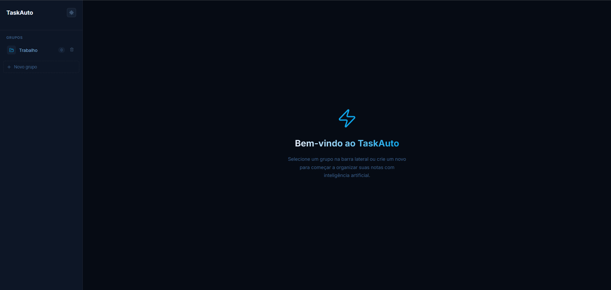
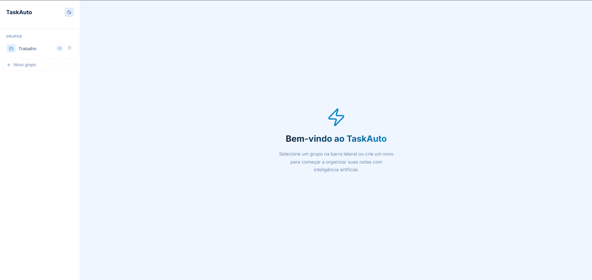
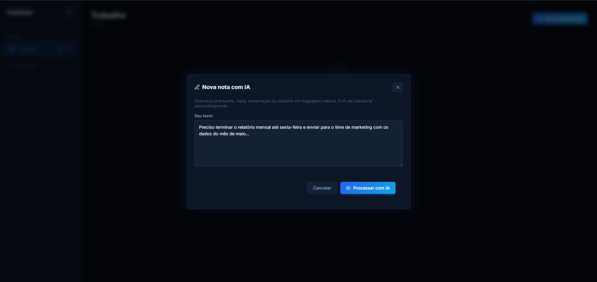
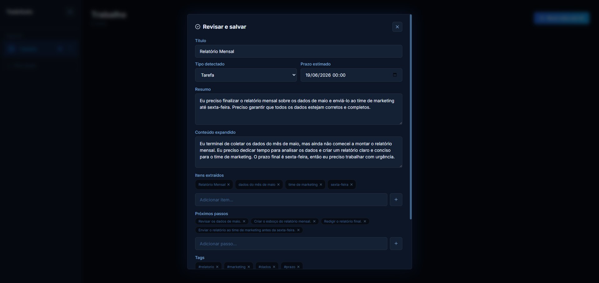
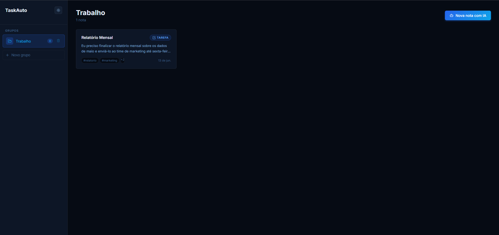

# ⚡ TaskAuto

> **Uma plataforma avançada de gerenciamento de anotações impulsionada por Inteligência Artificial rodando 100% na sua máquina.**

O **TaskAuto** transforma textos livres e não estruturados em informações ricas. Utilizando processamento de linguagem natural (NLP), o sistema categoriza magicamente suas anotações em tarefas, metas e relatórios, definindo automaticamente prazos, extraindo ações pendentes e associando tags.

Para garantir sua privacidade e facilidade de uso, a versão atual do projeto **não exige autenticação** e foi feita para rodar inteiramente de forma local. Suas tarefas, metas e dados não saem da sua máquina.



---

## ✨ Principais Funcionalidades

- **Processamento via IA Local:** Escreva uma ideia em linguagem natural e o sistema estruturará automaticamente um título, resumo, extração de métricas/tarefas e estipulação de prazo.
- **Detecção de Contexto:** O motor de IA classifica cada entrada como *Tarefa*, *Meta*, *Relatório Diário* ou *Observação*.
- **Edição Dinâmica:** Edite cada atributo da sua anotação processada, ajustando tags, gerenciando listas de próximos passos e redefinindo datas críticas.
- **Gerenciamento por Grupos:** Organize suas dezenas de anotações através de uma arquitetura de pastas limpa na barra lateral.
- **Foco em Privacidade:** Sem banco de dados na nuvem e sem telas de login. O sistema roda localmente, para você e por você.

### 📸 Telas da Aplicação

**Modo Claro / Painel Principal**


**Modo Escuro / Painel Principal**


**Geração de Nota com IA**


**Visualização de Nota Processada**


**Visualização das notas criadas / Painel Principal**


---

## 🛠️ Como Funciona e Stack Tecnológica

O projeto é dividido em um front-end moderno e um back-end local que se comunica com o motor de IA (Ollama).

### Frontend
- **[React](https://reactjs.org/)** com **[Vite](https://vitejs.dev/)**: Renderização ultrarrápida e modular.
- **[TypeScript](https://www.typescriptlang.org/)**: Tipagem estática severa garantindo segurança de código.
- **Arquitetura BEM no CSS**: Todos os estilos da aplicação foram desenvolvidos em CSS Puro modularizado e estruturado sob a rigorosa metodologia BEM.

### Backend Integrado (Requisito)
A aplicação consome uma API local para processar as regras de negócio e realizar integrações.

🔗 **[Acessar o Repositório da API (Backend)](https://github.com/emnuelht/taskauto-api)**

- **Java Spring Boot**: Microsserviço gerenciador de regras de negócio rodando localmente.
- **Ollama (Gemma3 / Llama)**: Motor local responsável pela inferência e formatação de linguagem natural das notas, sem envio de dados para terceiros.

---

## 🚀 Como Clonar e Instalar (Rodando Localmente)

Como a aplicação é 100% voltada para o uso local, o processo de setup requer que o backend e o motor de IA também estejam configurados no seu ambiente.

### 1. Pré-requisitos
Certifique-se de ter os seguintes componentes instalados na sua máquina:
- **Git**: Para clonar o projeto.
- **Node.js** (v16 ou superior): Para rodar o Frontend.
- **Serviço Backend:** A API do TaskAuto desenvolvida em Spring Boot deve estar rodando em `http://localhost:8080`.
- **Motor de IA (Ollama):** O servidor do Ollama deve estar rodando em background com o modelo configurado (ex: Gemma3 ou Llama) para processar os textos.

### 2. Clonando e Instalando o Frontend
Abra o seu terminal e execute os comandos abaixo para clonar o repositório e baixar as dependências:

```bash
# Clone o repositório
git clone https://github.com/SEU_USUARIO/TaskAutoSiteGithub.git

# Entre na pasta do projeto
cd TaskAutoSiteGithub

# Baixe as dependências do Node
npm install
```

### 3. Executando a Aplicação
Com o backend local e o Ollama já em execução, inicie a plataforma front-end através do Vite:

```bash
npm run dev
```

Após compilar, o aplicativo estará disponível nativamente na porta `5173`. Acesse no seu navegador:  
**`http://localhost:5173`**

Pronto! Agora você tem uma ferramenta poderosa de gestão de tarefas com IA rodando na sua própria máquina de forma segura e privada.

---

*Desenvolvido com o objetivo de redefinir a produtividade diária, reduzindo a fricção entre pensar e organizar.*
